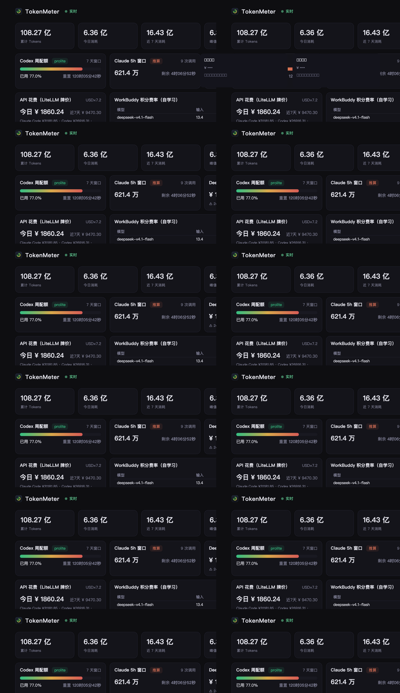

<div align="center">

# Token Watcher

**Local, real-time token usage & quota dashboard for AI coding agents.**

One resident process parses the session logs your AI coding tools already
leave on disk, normalizes them into a per-request event stream, and serves a
live dashboard: Codex-style stats, real-time quota cards, vendor balance
polling, cost estimation with reconciliation, and a macOS menu-bar capsule.
Zero runtime dependencies. Fully local.

[](https://www.npmjs.com/package/token-watcher)
[](https://github.com/luwill/token-watcher/actions/workflows/test.yml)
[](./LICENSE)
[](#运行要求)

[简体中文](./README.zh-CN.md) · English



> Screenshot is real running data (vendor balances and project names masked).

</div>

## Why Token Watcher

Most token trackers recompute a report when you ask. Token Watcher watches
the logs as they're written: FSEvents → incremental parse → SSE push, the
dashboard updates in **under a second** while your agents work. Everything is
stored as **per-request events**, not pre-aggregated buckets — so you can
drill from a day, to a session, to a single request's token curve.

It also refuses to lie to you: estimated sources are labeled as such
(Antigravity ≈), models without pricing show up as *unpriced* instead of a
made-up cost, and vendor balances are **reconciled** against locally computed
spend so you can see when the estimate drifts.

| | Token Watcher | TokenTracker | ccusage | Tokscale |
|---|---|---|---|---|
| Interface | Local web dashboard + menu bar | Native apps + web | CLI reports | TUI / CLI |
| Refresh | Real-time (FSEvents + SSE, <1s) | Hook-triggered sync | Manual run | Manual run |
| Granularity | Per-request events | 30-min buckets | Daily | Daily |
| Sources | 13, incl. China stack (ccmr, dsh, Qoder, Kimi Code, WorkBuddy) | 39 | Multi-agent | Multi-agent |
| Cost | LiteLLM prices + **balance reconciliation** + credits ledger | LiteLLM estimate | Estimate | Estimate |
| Official quotas | Claude / Codex direct-read, Cursor billing CSV | 17 providers | Limited | Several |
| Telemetry | None, ever | Opt-out | None | None |
| Install | One zero-dependency npm package (incl. universal menu-bar app) | npm + platform packages | npm | npm |

## Supported tools (13 sources)

| Tool | Data location | What you get |
|---|---|---|
| Claude Code | `~/.claude/projects` | Per-request tokens, model mix |
| ccmr (claude-code-model-router) | `~/.claude-gateway/projects` | Same, with real model names behind the router |
| Codex | `~/.codex/sessions` | Per-request tokens, **official quota % and resets** (5h / weekly), models incl. auto-review, tool calls |
| ZCode | `~/.zcode/cli/db/db.sqlite` | Per-request details, tool calls, **GLM Coding Plan credit windows** (5h / weekly, official API) |
| dsh (DeepSeek Harness) | `~/.dsh/sessions` | Per-request details (multi-frame zstd snapshots) |
| WorkBuddy | `~/.WorkBuddy/projects` | Per-request details + **self-learned credit rates** |
| Grok Build | `~/.grok/sessions` | Per-turn usage (incl. vendor cost scale), tool calls |
| Pi | `~/.pi/agent/sessions` | Per-request details, tool calls |
| OpenCode | `~/.local/share/opencode/opencode.db` | Per-request details, tool calls |
| Antigravity ≈ | `~/.gemini/antigravity*/brain/**/transcript.jsonl` | Per planner turn — input from authoritative db context deltas, output estimated from content |
| Kimi Code | `~/.kimi-code/sessions/**/wire.jsonl` | Per-turn details (3 usage shapes auto-detected) |
| Qoder | `~/.qoder{,-cn}/projects/**` | **Credits ledger** (upstream reports credits, not tokens, locally) |
| Cursor | Account-level usage CSV | Per-request details — Cursor stores nothing per-request locally, so this polls the official export with local credentials |

Not supported: web chats (ChatGPT etc.) — token counts live server-side, nothing to parse.

> **Honest-caliber notes**: Kimi Code, Qoder, Antigravity and Cursor were each
> verified on real local data against an independent recomputation, row by row.
> Qoder currently reports credits but zero tokens locally — credits go to a
> dedicated ledger shown as a "credits spent" card, never fabricated into
> tokens. Estimated sources are labeled (≈).

## Quick start

```bash
npx --yes token-watcher@latest serve
# dashboard opens automatically → http://127.0.0.1:8787
```

Long-term:

```bash
npm install -g token-watcher
token-watcher serve
token-watcher install-agent             # launchd auto-start (macOS)
token-watcher bar                       # menu-bar capsule
token-watcher bar                       # macOS menu-bar capsule
```

Homebrew: `brew install luwill/token-watcher/token-watcher`

### CLI reference

```bash
token-watcher today [--json|--light]            # today's usage (machine-readable / pure ASCII)
token-watcher sessions --day 2026-09-20 [--csv] [--git]   # per-session stats (+ git commit attribution)
token-watcher wrapped [--year 2026] [--json]    # year in review
token-watcher roi [--json]                     # subscription ROI (API-equivalent vs paid)
token-watcher doctor                            # environment + store + per-source health
token-watcher uninstall [--purge-data] [--yes]  # remove all local traces
token-watcher --version
```

## Features

- **Real-time**: FSEvents on every source dir → incremental parse → SSE push (<1s)
- **Incremental collection**: byte cursors / sqlite watermarks / snapshot re-parse; dedup keys make rescans idempotent; collector versioning auto-backfills on logic upgrades
- **Dashboard**: metric cards, year-long GitHub-style heatmap (daily/weekly/cumulative), by-day/model/tool charts, live request feed
- **Session drill-down**: click any day → sessions (peak-context estimate) → per-request token curve
- **Quotas**: Codex official (direct-read), Claude official (local OAuth token → official usage endpoint; falls back to 5h window estimation)
- **Subscription ROI**: this month's API-equivalent cost vs what you actually pay (configure prices in `~/.tokenmeter/subscriptions.json`; `token-watcher roi`)
- **Balances & costs**: DeepSeek/Kimi balance polling; LiteLLM pricing with per-model CNY conversion; **balance reconciliation**; Qoder credits ledger
- **Health self-check**: parse errors turn red, "file being written but no new events" turns yellow — silent format drift gets caught
- **Exports & backups**: CSV, session/annual CLI reports, daily `VACUUM INTO` snapshots (7 kept)

### Subscription ROI

Edit `~/.tokenmeter/subscriptions.json` with what you actually pay (one entry
per tool, `price_cny` or `price_usd`):

```json
{ "monthly": {
    "claude-code": { "name": "Claude Max", "price_usd": 200 },
    "kimi":        { "name": "Kimi plan",  "price_cny": 49 },
    "glm":         { "tool": "zcode", "models": "glm", "name": "GLM Coding Plan", "price_cny": null },
    "minimax":     { "tool": "zcode", "models": "minimax", "name": "MiniMax (via ZCode)", "price_cny": null } } }
```

Entry keys are identifiers; `tool` selects the data source (needed when one
tool carries multiple subscriptions, e.g. GLM and MiniMax both flowing through
ZCode), and `models` filters aggregation by model prefix. Entries with the
price unset still show their API-equivalent, labeled "price not set".

The dashboard and `token-watcher roi` then compare this month's API-equivalent
cost (same pricing chain as the cost card, including peak/off-peak) against
your real spend. Clearly labeled as a hypothetical caliber: subscriptions come
with rate limits and API prices may be discounted. Credits-based tools (Qoder)
show this month's credits spent instead of a made-up ratio.

## Privacy

Fully local. The dashboard binds to 127.0.0.1 only (with Host validation).
API keys and tokens are used inside the server process only, never stored or
sent to the frontend. Usage data never leaves your machine.

Outbound requests (only these, none carry your usage data): FX rate (12h),
LiteLLM price table (24h), vendor balances (30min, with your key), Claude
official quota (10min, with Claude Code's local OAuth token), Cursor usage
CSV (30min, with a cookie built from local credentials), GLM Coding Plan
credit quota (10min, with ZCode's own local API key; MCP tool quota is read
from local logs only). Set `TOKENMETER_OFFLINE=1` to skip all of them.

## Requirements

**Node ≥ 22.13** (`node:sqlite`). macOS fully supported (menu bar + launchd);
core pipeline CI-tested on macOS/Ubuntu/Windows. dsh source needs system
`zstd`. Non-official tool: parses private local formats that upstreams may
change — the health panel will flag it instead of failing silently.

## Architecture

See [docs/ARCHITECTURE.md](./docs/ARCHITECTURE.md) (Chinese, with per-source
format notes and verification methodology). Core: one collector per source
under `src/collectors/*` (incremental + dedup + version), `src/scanner.js`
schedules, SQLite event store, HTTP API + SSE in `src/server.js`, zero-build
frontend in `web/`. Adding a source = one collector + registry entry + a
color. See [CONTRIBUTING.md](./CONTRIBUTING.md).

## License

[MIT](./LICENSE)
